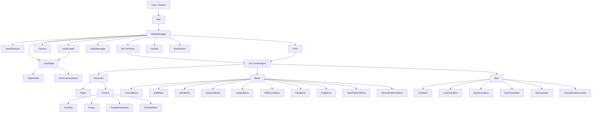

# 2026 OOPL Final Report

## 組別資訊

- 組別：63
- 組員：113370239 徐法恩
- 復刻遊戲：Super Mario Bros

## 專案簡介
### 遊戲簡介

- 瑪利歐是知名2D橫向捲軸遊戲。也是我幼兒園、國小時，最常玩、喜歡的遊戲，為了想重溫小時候的回憶、更了解這款遊戲，所有選擇復刻瑪利歐兄弟（紅白機版本）為主題。
- 本專案有三個關卡，遊玩順序為 `1-1 -> 1-2 -> 1-3`，過關後會進入下一關，完成最後一關後回到標題畫面。

### 組別分工

- 由於我是一個人一組，所以遊戲皆由我一個人完成。

## 遊戲介紹

### 遊戲規則

- **基本操作**
  - `A/D` 或左右方向鍵：左右移動
  - `Space` / `W` / 上方向鍵：跳躍
  - `Z`：奔跑；Fire Mario 狀態下也可發射火球
  - `Enter`：開始遊戲；遊玩中可暫停或恢復
- **標題與玩家選擇**
  - 標題畫面可選擇 `1 PLAYER GAME` 或 `2 PLAYER GAME`。
  - 1P 使用 Mario；2P 模式會保存不同玩家的 lives、score、coins、level、form 與 checkpoint，讓玩家輪流進行。
- **關卡目標**
  - 玩家從關卡起點往右前進，避開坑洞、敵人與障礙。
  - 碰到終點旗杆後，會觸發滑旗、走向城堡、時間結算與下一關流程。
- **敵人互動**
  - 踩踏 Goomba 會消滅敵人。
  - Koopa 被踩後會縮成龜殼，龜殼可被踢出並擊倒其他敵人。
  - Piranha Plant 會從水管中出現。
  - 以上敵人玩家皆可用火球攻擊。
- **道具與變身**
  - 小 Mario 吃蘑菇會變成 Super Mario。
  - Super Mario 吃到火焰花會變成 Fire Mario 狀態，可以發射火球。
  - Super Mario 或 Fire Mario 受傷會降級成 小 Mario
  - 小 Mario 受傷或掉落虛空，會失去生命。
  - Mario 吃到星星會進入幾秒？無敵狀態。
  - 1UP 蘑菇會增加生命。
- **方塊與場景**
  - 問號方塊與磚塊可產生金幣、蘑菇、火焰花、星星或 1UP。
  - Hidden Block 只有被撞擊後才會出現。
  - Multi-Coin Block 可在短時間內連續敲出10個金幣。
  - 水管可連接地下區域、出口區域或下一段關卡。
- **HUD 與流程**
  - HUD 會顯示分數、金幣、世界編號與剩餘時間。
  - 時間低於 100 會切換 hurry-up 音樂；時間歸零會進入 Time Up 流程。
  - 玩家死亡後若仍有生命，會從目前關卡或 checkpoint 復活；生命歸零後進入 Game Over。
- **Debug mode**
  - `1/2/3`：快速切換到 `1-1`、`1-2`、`1-3`
  - `4/5/6`：切換 Small / Super / Fire 狀態
  - `7`：切換星星無敵

### 遊戲畫面

@@幫我補上更新所有照片並附上簡單講解，在Screenshot folder
| 階段 | 遊戲畫面 |
|:---:|:---:|
| 標題畫面 |  |
| 1-1 地上關卡 |  |
| 1-2 地下關卡 |  |
| 1-3 平台關卡 |  |

## 程式設計

### 程式架構
@@ 是不是太簡單了，細節一點

@@以下繼承鏈補充的更多一點吧，要具體

以下箭頭代表繼承、持有或主要呼叫關係：

- `Core::Context` - PTSD framework 的執行環境，負責建立視窗與主迴圈。
- `App` - 將 framework 的 `Start()`、`Update()`、`End()` 轉接到遊戲邏輯，並處理離開遊戲。
- `GameManager` - 核心遊戲管理器，持有玩家、敵人、方塊、道具、火球、碎磚、相機、HUD、音效與關卡資料。
- `GameSession` - 保存玩家進度，例如 lives、score、coins、level、form 與 checkpoint。
- `LevelLoader` / `LevelData` - 讀取 JSON 關卡，將檔案內容轉成 `ObjectData` 與 checkpoint 等資料。
- `Player` - 處理輸入、物理、動畫、變身、受傷、星星無敵、火球請求、水管動畫與過關流程。
- `Enemy` - 敵人基底類別，提供移動、踩踏結果、死亡狀態與地形碰撞介面。
- `Block` - 場景物件基底類別，依照子類別實作地板、磚塊、問號方塊、水管、旗杆與平台行為。
- `Item` - 道具基底類別，讓金幣、蘑菇、火焰花、星星與 1UP 有一致的更新與取得流程。
- `Camera` - 將 world coordinates 轉換成 PTSD 螢幕座標，並限制鏡頭不要超出關卡邊界。
- `AudioManager` - 統一管理 BGM、SFX、事件音樂、暫停恢復與 hurry-up 音樂切換。

### 程式技術

- **使用狀態機控制遊戲流程**
  - `GameManager` 使用 `FlowState` 管理 `Title`、`LevelIntro`、`IntroCutscene`、`Playing`、`TimeUp`、`LevelClearTransition`、`LevelClearPause` 與 `GameOver`。
  - 這樣可以讓標題畫面、遊玩、死亡、過關、時間結算與切關流程分開處理，避免所有條件混在同一段 update 中。
- **分類不同遊戲物件**
   @@強調OOP繼承
  - 因此專案使用 `Character`、`Enemy`、`Block`、`Item` 為父類別，再讓 `Goomba`、`Koopa`、`QuestionBlock`、`MushroomItem` ...等子類別實作自己的行為。

  @@「objectcast幫我補充」
  - `Enemy::Stomp()` 可讓 Goomba 直接死亡、Koopa 進入龜殼狀態、Koopa Paratroopa 先失去翅膀。
- **檔案讀取**
  - 關卡儲存 JSON 裡，透過 「_.cpp 的 GameManager::LoadLevel()」讀取器讀入後，
  - `LevelLoader::Load()` 讀入後，依照_.hpp 的 ObjectData::type」建立對應的 C++ 物件將物件建構，初始化關卡。
   例如有：`backgroundImage`、`theme`、`levelWidth`、`levelHeight`、`playerSpawn`、`objects`、`introCutscene` 與 `checkpoints`。
- **鏡頭**
   @@描述一下鏡頭的技術
- **碰撞與物理**
  - 玩家、敵人、道具、火球與地形使用 AABB 判斷。
  - @@請改寫具體一點   玩家與方塊碰撞會參考 previous position、velocity 與 penetration，判斷是落地、撞頭或側邊碰撞。
  - 敵人和道具也有各自的 block collision pass，避免全部互動塞在同一段程式中。
- **水管與關卡切換**
  - 可進入的水管會在 JSON 中設定 `targetLevel`、`targetSpawn` 與 `opening`。
  - 玩家進水管時會先播放進入動畫，再由 `GameManager` 暫存 pending level 與 spawn，等待動畫完成後切換關卡。
  @@動畫是透過裁切這個要說

- **敵人生成與效能控制**
  - 敵人資料先存在 `m_EnemySpawnQueue`，等敵人的位置進入鏡頭附近才真正建立物件。
  - 這樣可以避免遠處敵人在畫面外提前行動，也減少同時更新的物件數量。
- **音效系統**
  - `AudioManager` 封裝 overworld、underground、starman、death、level clear、game over、hurry-up 等音樂流程。
  - SFX 使用 cache 避免每次播放都重新建構音效物件；音檔不存在時記錄 warning，不讓遊戲直接 crash。

### 使用到 AI/AI Agent 的部分

本專案使用 Codex 與 Claude 輔助開發，生成程式碼、Debug。

## 結語
### 問題與解決方法

- **碰撞箱：玩家高速落下時可能穿過地形**
  - 如果只看目前 frame 的重疊結果，玩家速度較快時容易判斷錯碰撞方向。
  - 後來碰撞時加入 previous position、velocity 與 penetration 判斷，並限制最大 frame delta，讓落地、撞頭與側撞更穩定。
- **地圖載入：敵人如果一開始全部生成，會在畫面外提前行動**
  - Mario關卡很長，遠處敵人不應該在玩家到達前就移動或掉落。
  - 因此將敵人資料先放入 spawn queue，等鏡頭靠近後才由 `GameManager` 建立實際敵人物件。
- **OOP：方塊、敵人與道具類型很多，全部寫死會很難維護**
@@ 重寫，要強調OOP
  - 本專案的物件種類包含多種敵人、多種方塊、多種道具與水管觸發器。
  - 後來使用基底類別、多型與 JSON `type` mapping，讓新增物件時可以集中在對應 class，而不是到處修改大型 if-else。

### 自評

| 項次 | 項目 | 完成 |
|:---:|---|:---:|
| 1 | 完成專案權限改為 public | V |
| 2 | 具有 debug mode 的功能 | V |
| 3 | 解決專案上所有 Memory Leak 的問題 | V |
| 4 | 報告中沒有任何錯字，以及沒有任何一項遺漏 | V |
| 5 | 報告至少保持基本的美感，人類可讀 | V |

### 心得
- **113370239 徐法恩**

### 貢獻比例

> 請依實際組員與貢獻填入。

| 組員 | 主要貢獻 | 貢獻比例 |
|:---:|---|:---:|
| 113370239 徐法恩| 獨自一人完成 Mario遊戲 | 100% |
