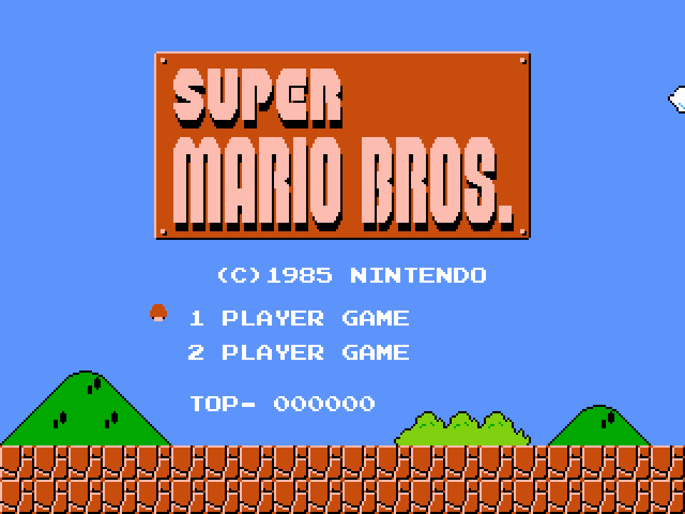
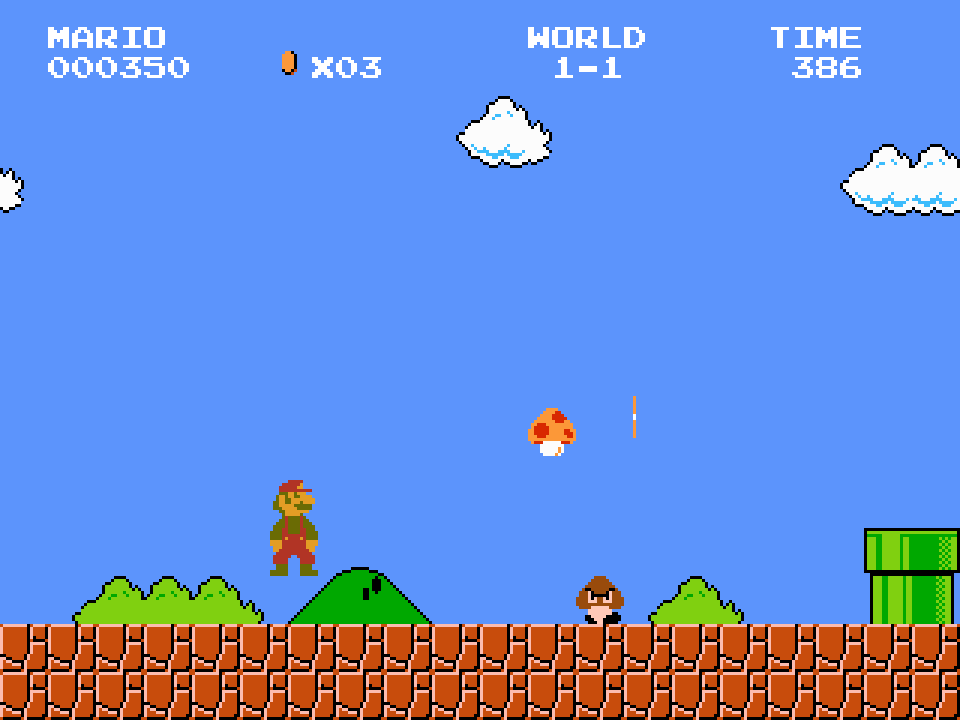
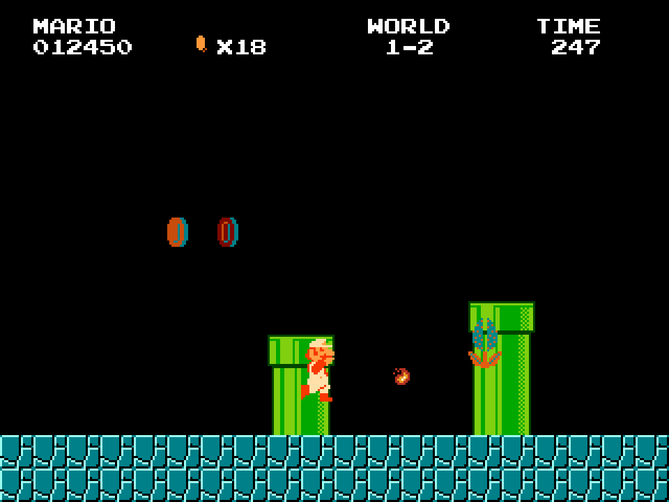
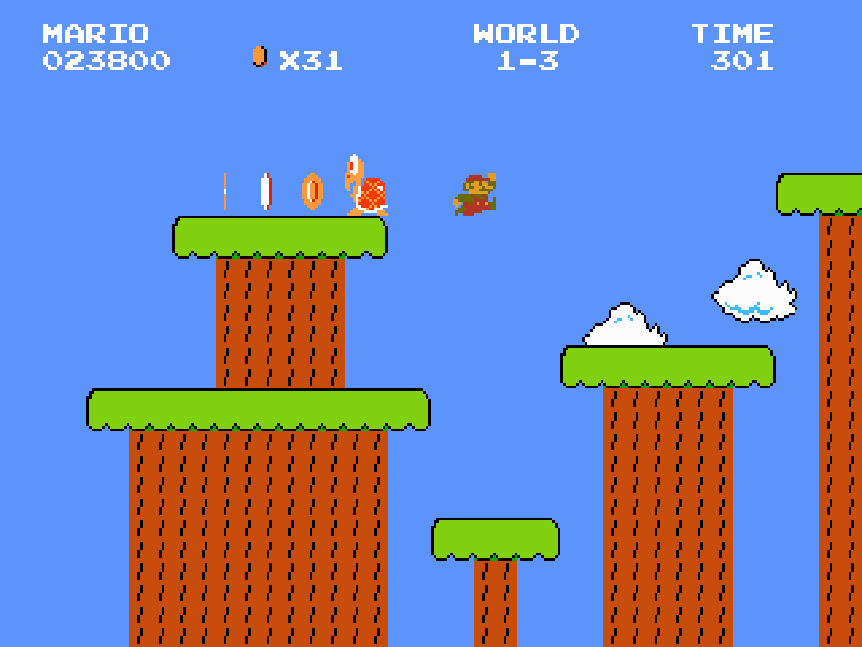

# 2026 OOPL Final Report

## 組別資訊

組別：**（請填入組別編號）**  
組員：**（請填入組員姓名與學號）**  
復刻遊戲：**Super Mario Bros. / Mario-like 2D Platformer**

## 專案簡介

### 遊戲簡介

本專案使用 C++17、CMake 與 PTSD framework 製作 2D 橫向卷軸平台遊戲，復刻經典《Super Mario Bros.》的核心玩法。玩家可以操作 Mario 或 Luigi，在地上、地下與平台關卡中前進，透過跳躍、踩踏、道具強化、火球攻擊與水管切換完成關卡。

遊戲目前以 `Resources/data/*.json` 作為關卡資料來源，程式在執行時讀入背景、地形、方塊、敵人出生點、道具與旗杆等物件。主線關卡鏈為 `1-1 -> 1-2 -> 1-3`，過關後會進入下一關，最後回到標題畫面。

### 組別分工

> 下列分工請依實際組員姓名調整。

| 工作項目 | 負責內容 | 負責人 |
|---|---|---|
| 遊戲流程與狀態管理 | 標題畫面、關卡 intro、遊玩中、Time Up、過關與 Game Over 流程 | （請填入） |
| 玩家與物理 | Mario/Luigi 操作、跳躍、跑步、變身、死亡與過關動畫 | （請填入） |
| 敵人與碰撞 | Goomba、Koopa、Koopa Paratroopa、Piranha Plant、踩踏與龜殼互動 | （請填入） |
| 方塊與道具 | Question Block、Brick、Hidden Block、Multi-Coin Block、蘑菇、火焰花、星星、1UP | （請填入） |
| 關卡與資源 | JSON 關卡資料、背景圖、sprite、音效、字體與 HUD | （請填入） |
| 測試與報告 | build 驗證、功能檢查、截圖與期末報告整理 | （請填入） |

## 遊戲介紹

### 遊戲規則

- 標題畫面可選擇 1 PLAYER GAME 或 2 PLAYER GAME，按 `Enter` 或 `Space` 開始。
- 操作方式：`A/D` 或左右方向鍵移動，`Space` / `W` / 上方向鍵跳躍，`Z` 奔跑；Fire Mario 可用 `Z` 發射火球。
- 玩家要從關卡起點往右前進，避開坑洞、敵人與障礙，最後碰到旗杆完成關卡。
- 踩踏 Goomba 會消滅敵人；Koopa 被踩後會縮成龜殼，龜殼可踢出並擊倒其他敵人。
- 問號方塊與磚塊可產生金幣、蘑菇、火焰花、星星或 1UP。
- 小 Mario 吃蘑菇會變 Super Mario；Super/Fire Mario 受傷會降級；小 Mario 受傷或掉落會失去生命。
- 星星可提供短時間無敵；Fire Mario 可發射火球攻擊敵人。
- 部分水管可進入地下區域或切換關卡。
- HUD 會顯示分數、金幣、世界編號與剩餘時間；時間歸零會進入 Time Up 流程。
- Debug mode：`1/2/3` 可切換 Small/Super/Fire 狀態，`7` 可切換星星無敵，`4/5/6` 可快速進入 1-1、1-2、1-3。
- 遊玩中可按 `Enter` 暫停或恢復。

### 遊戲畫面

> 本節圖片使用專案內實際 `Resources/Asset` 背景、sprite 與 960x720 視窗比例輸出；由於本次執行環境無法直接使用系統截圖 API 擷取 SDL 視窗，因此以同一批 runtime 資源產生報告用遊戲畫面。

圖 1：標題畫面，包含遊戲 logo、1P/2P 選單與 TOP 分數。

圖 2：1-1 地上關卡，包含 HUD、問號方塊、道具、Goomba 與水管地形。

圖 3：1-2 地下關卡，展示地下場景、Fire Mario、火球與食人花。

圖 4：1-3 平台關卡，展示樹平台、金幣、Koopa 與跳躍移動場景。

## 程式設計

### 程式架構

本專案的主程式由 `src/main.cpp` 建立 `Core::Context` 與 `App`，並依序呼叫 `Start()`、`Update()`、`End()`。`App` 只負責 PTSD framework 的生命週期轉接，實際遊戲規則集中在 `GameManager`。

主要架構如下：

| 模組 | 責任 |
|---|---|
| `App` | 接收 framework update，處理 ESC / 視窗關閉，轉呼叫 `GameManager` |
| `GameManager` | 遊戲流程、關卡載入、物件生命週期、碰撞、HUD、音效與切關 |
| `LevelLoader` / `LevelData` | 從 JSON 載入背景、關卡尺寸、出生點、物件與 checkpoint |
| `Player` | 玩家輸入、物理、動畫、變身、受傷、星星無敵、火球請求與過關流程 |
| `Enemy` 系列 | Goomba、Koopa、Koopa Paratroopa、Piranha Plant 等敵人行為 |
| `Block` 系列 | 地板、牆、磚塊、問號方塊、水管、旗杆、隱藏方塊、移動平台 |
| `Item` 系列 | 金幣、蘑菇、火焰花、星星、1UP 等道具 |
| `Camera` | 將 world coordinates 轉換成 PTSD 螢幕座標，處理水平卷軸 |
| `HUD` | 顯示分數、金幣、世界與剩餘時間 |
| `AudioManager` | 統一管理 BGM、SFX、事件音樂與 hurry-up 音樂 |
| `GameSession` | 保存 1P/2P 的 lives、score、coins、level、form 與 checkpoint |

### 程式技術

1. **物件導向設計**

   玩家、敵人、方塊與道具各自有基底類別，透過繼承與 virtual function 實作不同型態的行為。例如 `Enemy::Stomp()` 由 Goomba、Koopa、Koopa Paratroopa 分別回傳不同結果，`Block::OnHit()` 則讓磚塊、問號方塊、隱藏方塊與多金幣方塊處理不同敲擊效果。

2. **資料驅動關卡**

   關卡不是寫死在程式碼中，而是由 JSON 描述。`LevelLoader::Load()` 讀入 `backgroundImage`、`theme`、`levelWidth`、`levelHeight`、`playerSpawn`、`objects` 與 `checkpoints`，再由 `GameManager::LoadLevel()` 根據 `type` 建立實際 C++ 物件。這讓新增關卡或調整物件位置時，不需要重編核心邏輯。

3. **狀態機流程管理**

   `GameManager` 使用 `FlowState` 管理 `Title`、`LevelIntro`、`IntroCutscene`、`Playing`、`TimeUp`、`LevelClearTransition`、`LevelClearPause`、`GameOver` 等狀態。這讓標題畫面、遊玩、死亡、過關與切關流程彼此分離，降低不同流程互相干擾的機率。

4. **碰撞與物理**

   多數碰撞使用 AABB 判斷，玩家與方塊碰撞會搭配 previous position、velocity 與 penetration 判斷落地、撞頭或側碰。敵人、道具、火球與地形有各自的 collision pass，避免所有互動塞在同一段程式裡。

5. **相機與座標轉換**

   遊戲世界使用左上角為原點、y 軸向下的座標；PTSD 螢幕座標則以視窗中心為原點且 y 軸向上。`Camera::WorldToScreen()` 負責統一轉換，並以玩家位置水平追蹤、限制在關卡範圍內。

6. **渲染與資源管理**

   大多數場景物件繼承 `Util::GameObject`，透過 `Util::Renderer` 繪製。runtime 生成的 item、fireball、brick debris 會即時加入 renderer。專案大量使用 `std::shared_ptr` 管理 renderer 物件生命週期，避免手動 new/delete。

7. **音效系統**

   `AudioManager` 封裝 BGM 與 SFX，支援 overworld、underground、starman、death、level_clear、game_over 等事件音樂。SFX 使用 cache 避免每次播放都重複建構，音檔不存在時只記錄 warning，不讓遊戲 crash。

8. **遊戲性功能**

   已實作 1P/2P 輪流、checkpoint 復活、關卡鏈推進、倒數計時、hurry-up BGM、Time Up、Game Over、旗杆過關、城堡小旗、火球上限、連續踩踏/龜殼 combo 計分、移動平台、樹平台與水管進出動畫。

### 使用到 AI/AI Agent 的部分

本次期末報告整理使用 Codex 協助讀取專案結構、比對 `src/`、`include/` 與 `Resources/data/` 的實作內容，整理成報告中的架構、技術、規則與問題解法段落。報告用遊戲畫面也由 Codex 依專案實際資源產生。

AI/Agent 的用途主要是輔助文件撰寫與驗證，不取代對程式邏輯的理解；最終內容仍以本專案實際 C++ 程式與 JSON 關卡資料為準。

## 結語

### 問題與解決方法

| 問題 | 解決方法 |
|---|---|
| PTSD 螢幕座標與遊戲 world 座標方向不同 | 建立 `Camera::WorldToScreen()` 統一轉換，避免各物件各自處理座標 |
| 玩家高速落下時可能穿過地形 | 使用 previous position、velocity、penetration 判斷碰撞方向，並限制最大 frame delta |
| 敵人一次全部生成會造成效能與互動問題 | 使用 enemy spawn queue，敵人進入鏡頭附近才生成 |
| 方塊、敵人、道具類型很多，若寫死會難維護 | 透過繼承、多型與 JSON `type` mapping 讓新增物件更清楚 |
| 水管切關會牽涉玩家動畫、關卡載入、spawn override | 用 pending level/spawn 暫存切換目標，等進出水管動畫完成後再切換 |
| 過關、死亡、Time Up、Game Over 容易互相干擾 | 用 `FlowState` 狀態機切分流程，讓每個狀態只更新該處理的邏輯 |
| BGM 與事件音樂可能重疊 | `AudioManager` 區分 area BGM 與 event BGM，並用優先序處理 death/starman/clear 等事件 |
| 本次報告環境無法直接擷取 SDL 視窗 | 以專案實際背景與 sprite 依 960x720 runtime 比例輸出報告畫面 |

### 自評

| 項次 | 項目 | 完成 |
|---|---|---|
| 1 | 復刻 Mario-like 核心玩法：移動、跳躍、踩敵、道具、過關 | V |
| 2 | 完成專案權限改為 public | 待確認 |
| 3 | 具有 debug mode 的功能 | V |
| 4 | 解決專案上所有 Memory Leak 的問題 | 待確認 |
| 5 | 報告中沒有任何錯字，以及沒有任何一項遺漏 | V（組別/組員資訊需補） |
| 6 | 報告至少保持基本的美感，人類可讀 | V |
| 7 | 使用 JSON 載入關卡資料 | V |
| 8 | 具有多關卡與關卡切換 | V |
| 9 | 具有音效、BGM 與事件音樂 | V |
| 10 | 具有 1P/2P session 與 checkpoint | V |

### 心得

這次專案最有挑戰的地方不是單一角色或單一方塊的實作，而是讓所有系統在同一個遊戲迴圈裡穩定合作。玩家物理、敵人、道具、方塊、鏡頭、音效、HUD、關卡切換與過關流程都會互相影響，所以專案需要清楚的狀態管理與責任切分。

透過這次實作，我們更熟悉了 C++ 的物件導向設計、資源生命週期管理、JSON 資料驅動、碰撞判斷與遊戲狀態機。把關卡內容抽到 JSON 後，程式邏輯和關卡設計可以分開維護，對後續擴充也比較友善。

### 貢獻比例

> 請依實際組員與貢獻填入。

| 組員 | 主要貢獻 | 貢獻比例 |
|---|---|---|
| （請填入） | （請填入） | （請填入） |
| （請填入） | （請填入） | （請填入） |
| （請填入） | （請填入） | （請填入） |
