# 2026 OOPL Final Report

## 組別資訊

- 組別：63
- 組員：113370239 徐法恩
- 復刻遊戲：Super Mario Bros.

## 專案簡介

### 遊戲簡介

《Super Mario Bros.》是一款經典的 2D 橫向捲軸遊戲，也是我在幼兒園及國小時最常接觸、最喜歡的遊戲之一。為了重溫童年回憶，並從程式設計的角度理解角色控制、碰撞、捲軸、敵人行為及關卡流程，我選擇以紅白機版本的《Super Mario Bros.》作為本次復刻主題。

本專案以 C++17、CMake 與課程提供的 PTSD framework 開發，完成 `1-1`、`1-2`、`1-3` 三個主要關卡。遊玩順序為 `1-1 → 1-2 → 1-3`，玩家過關後會自動進入下一關，完成最後一關後回到標題畫面。關卡中另外包含可由水管連接的地下區域。

### 組別分工

本組為一人一組，所有工作均由我獨立完成（細項與貢獻比例見文末「貢獻比例」）。

## 遊戲介紹

### 遊戲規則

- **基本操作**
  - `A/D` 或左右方向鍵：左右移動。
  - `Space`、`W` 或上方向鍵：跳躍；按住與提早放開會影響跳躍高度。
  - `Z`：奔跑；Fire Mario 狀態下也可發射火球。
  - `Esc`：開啟或關閉暫停選單；選單中可調整音量、查看操作方式、切換 Debug mode、回到標題或離開遊戲。
- **標題與玩家選擇**
  - 標題畫面可選擇 `1 PLAYER GAME` 或 `2 PLAYER GAME`，按 `Enter` 或 `Space` 開始。
  - 1P 使用 Mario；2P 採輪流遊玩，使用同一個玩家物件切換 Mario/Luigi 外觀，並分別保存 lives、score、coins、level、form 與 checkpoint。
- **關卡目標**
  - 玩家從關卡起點往右前進，避開坑洞、敵人與障礙。
  - 碰到終點旗桿後會依接觸高度計分，接著自動滑下旗桿、走進城堡、結算剩餘時間並進入下一關。
- **敵人互動**
  - 踩踏 Goomba 會將它壓扁並消滅。
  - Koopa 被踩後會縮成龜殼；靜止龜殼可被踢出並擊倒其他敵人，且支援連續擊殺計分。
  - Koopa Paratroopa 第一次被踩會失去翅膀，之後才依一般 Koopa 的規則縮殼。
  - Piranha Plant 會週期性地從水管升起；玩家站在管口附近時不會升出。
  - 上述敵人皆可被火球或星星無敵狀態的玩家擊倒。
- **道具與變身**
  - Small Mario 吃到蘑菇會變成 Super Mario。
  - Super Mario 吃到火焰花會變成 Fire Mario，並可發射火球。
  - Super Mario 或 Fire Mario 受傷後會縮回 Small Mario，並短暫進入受傷無敵狀態。
  - Small Mario 受傷或掉入虛空會失去一條生命。
  - 吃到星星後會進入 10 秒的無敵狀態，期間碰到敵人可直接將其擊倒。
  - 1UP 蘑菇會增加一條生命；累積 100 枚金幣也會增加一條生命。
- **方塊與場景**
  - 問號方塊與磚塊可產生金幣、蘑菇、火焰花、星星或 1UP。
  - Hidden Block 初始不可見，被玩家從下方撞擊後才會出現。
  - Multi-Coin Block 可連續敲出金幣，預設上限為 10 枚。
  - 水管可連接地下區域、出口區域或下一段關卡。
  - `1-3` 包含單向樹台與移動平台，玩家可從下方穿過並從上方站立。
- **HUD 與流程**
  - HUD 會顯示分數、金幣、世界編號與剩餘時間。
  - 時間低於 100 時會切換為 hurry-up 音樂；時間歸零會進入 Time Up 流程。
  - 玩家死亡後若仍有生命，會從目前關卡的起點或最後通過的 checkpoint 復活；所有玩家生命歸零後進入 Game Over。
- **Debug mode**
  - Debug mode 可由暫停選單開啟或關閉。
  - `1/2/3`：快速切換到 `1-1`、`1-2`、`1-3`，並保留目前分數、金幣與生命。
  - `4/5/6`：切換 Small / Super / Fire 狀態。
  - `7`：切換無限星星無敵。
  - `8`：所有玩家增加三條生命。

### 遊戲畫面

#### 主要畫面與關卡

| 階段 | 遊戲畫面 | 說明 |
|:---:|:---:|---|
| 標題畫面 | 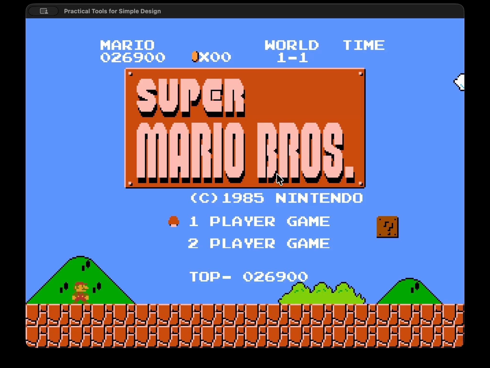 | 顯示最高分、1P/2P 選擇及游標，並以 `1-1` 場景作為背景。 |
| `1-1` 地上關卡 | 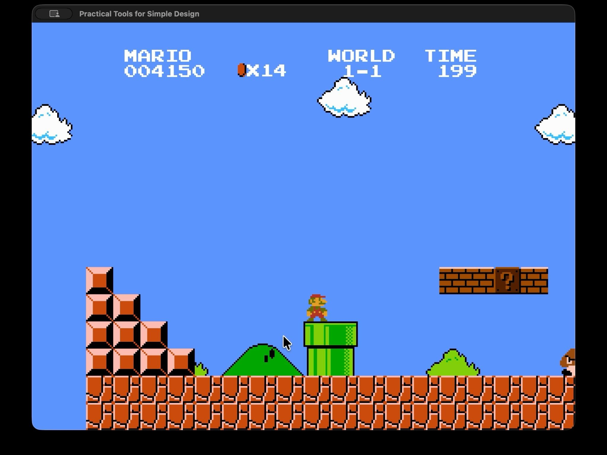 | 經典地上關卡，包含磚塊、問號方塊、水管、Goomba 與 Koopa。 |
| `1-2` 地下關卡 | 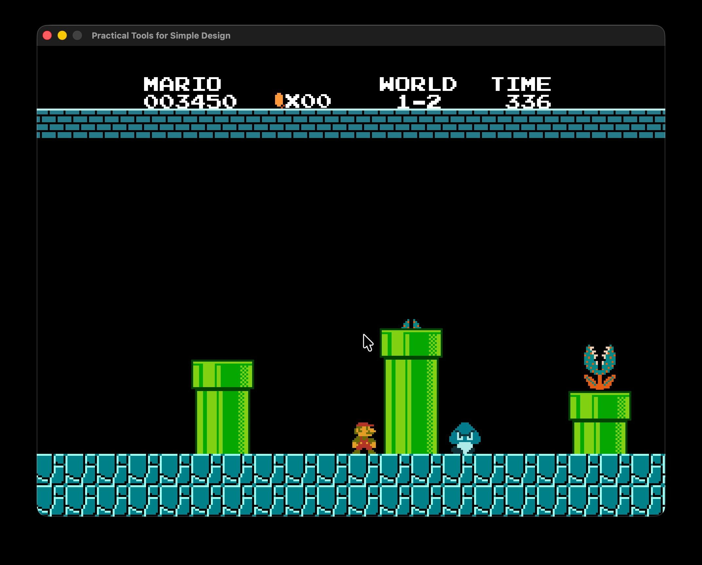 | 地下主題會切換場景配色與 BGM，並展示水管及 Piranha Plant。 |
| `1-3` 平台關卡 | 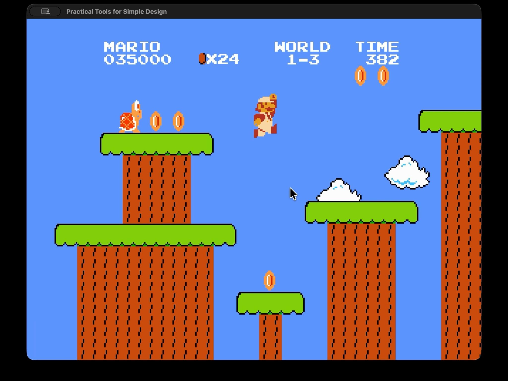 | 以樹台、空中金幣、飛行 Koopa 及移動平台構成的平台跳躍關卡。 |

#### 功能展示

| 功能 | 遊戲畫面 | 說明 |
|:---:|:---:|---|
| 暫停選單 | 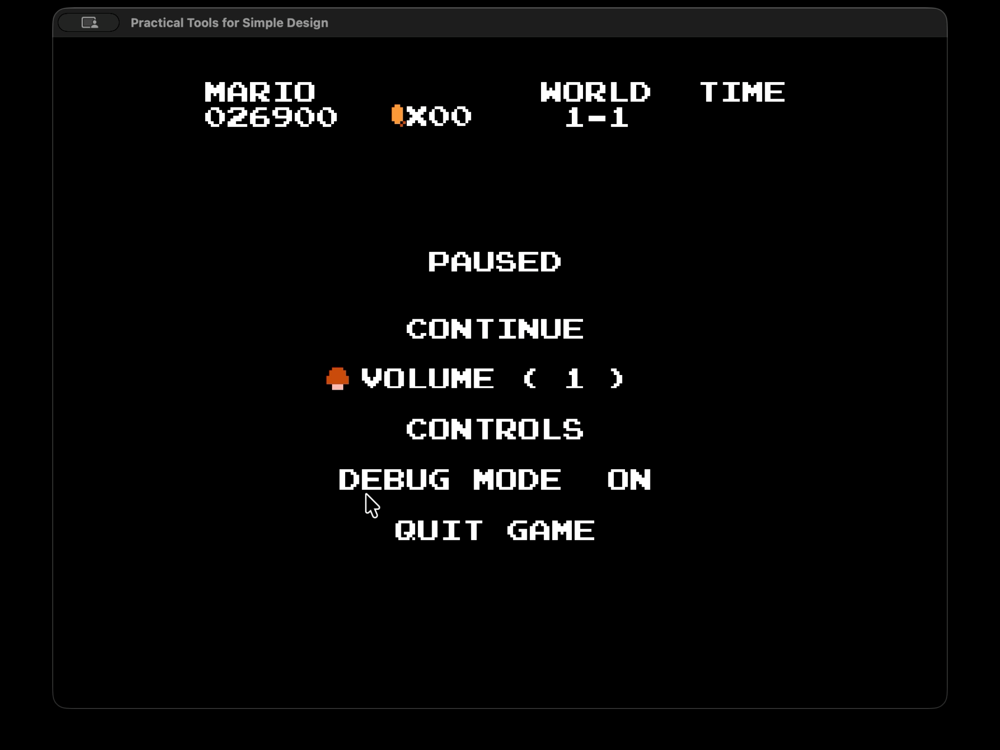 | 暫停時凍結遊戲世界，可繼續遊戲、調整音量、查看操作、切換 Debug mode 或離開。 |
| 問號方塊 | 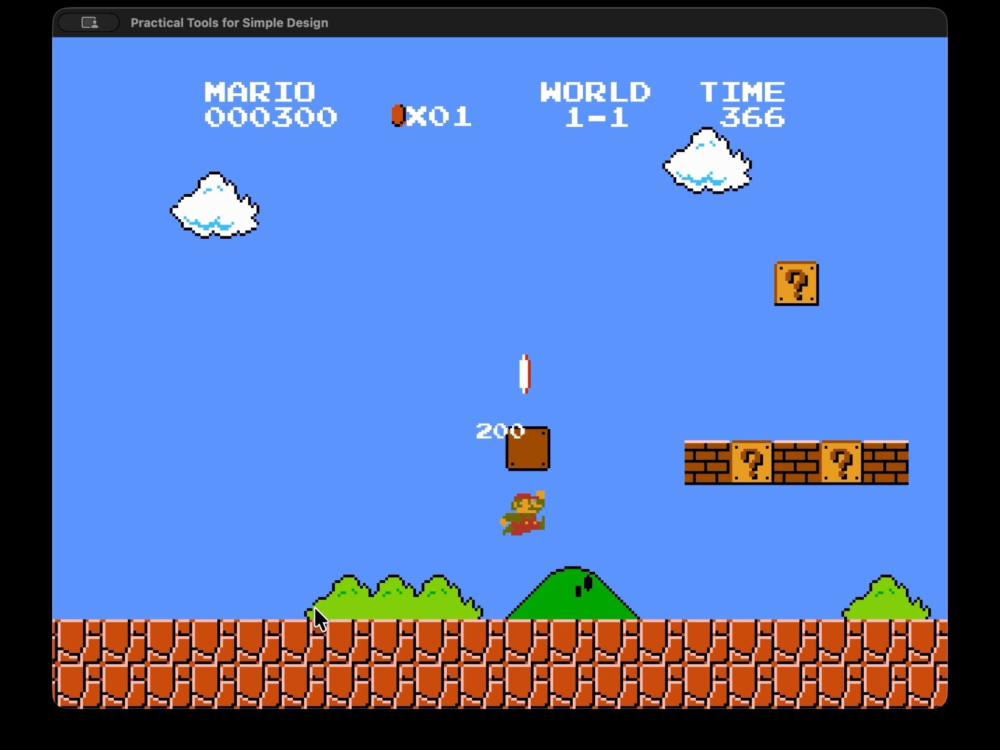 | 從下方撞擊方塊後產生金幣、更新 HUD，並顯示浮動得分。 |
| 蘑菇變身 | 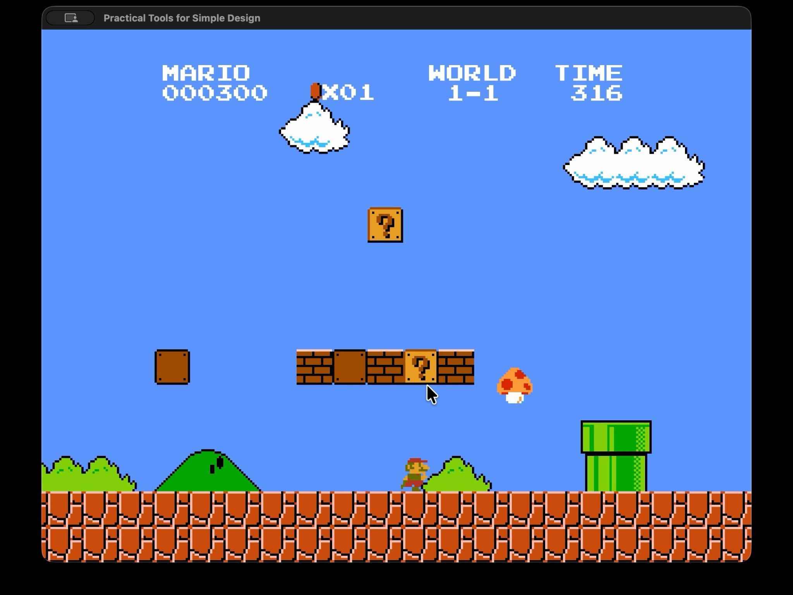 | Small Mario 取得蘑菇後播放形態切換動畫並變成 Super Mario。 |
| 水管傳送 | 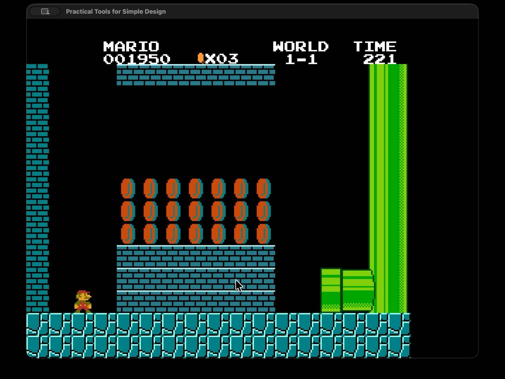 | 玩家依水管開口方向進入水管，再載入地下子關卡與指定出生點。 |
| Fire Mario | 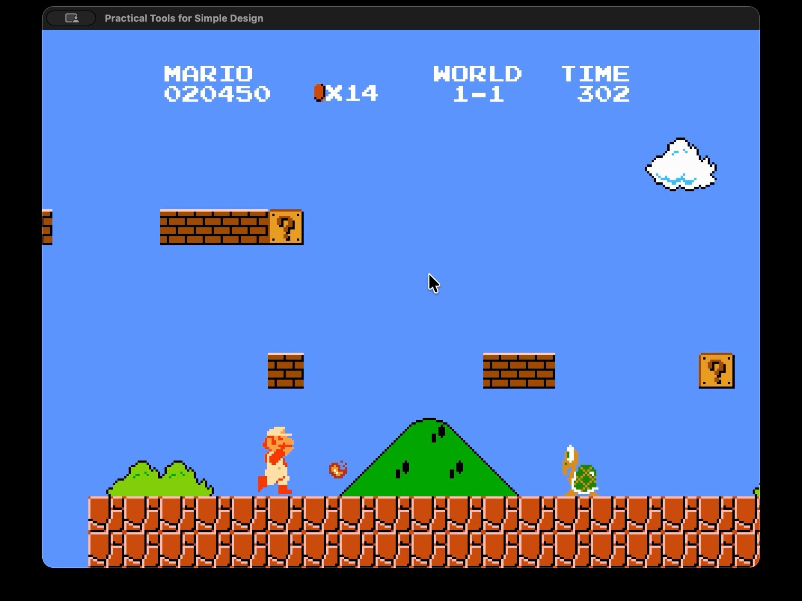 | Fire Mario 按 `Z` 發射火球；火球受重力影響、落地反彈並可消滅敵人。 |
| 頂磚攻擊 | 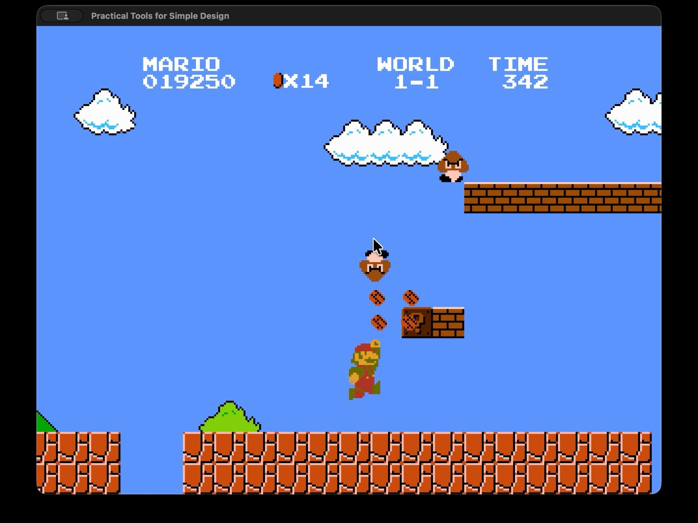 | Super/Fire Mario 可打碎磚塊；從下方頂起敵人腳下的方塊，也能將敵人擊倒。 |
| 星星無敵 | 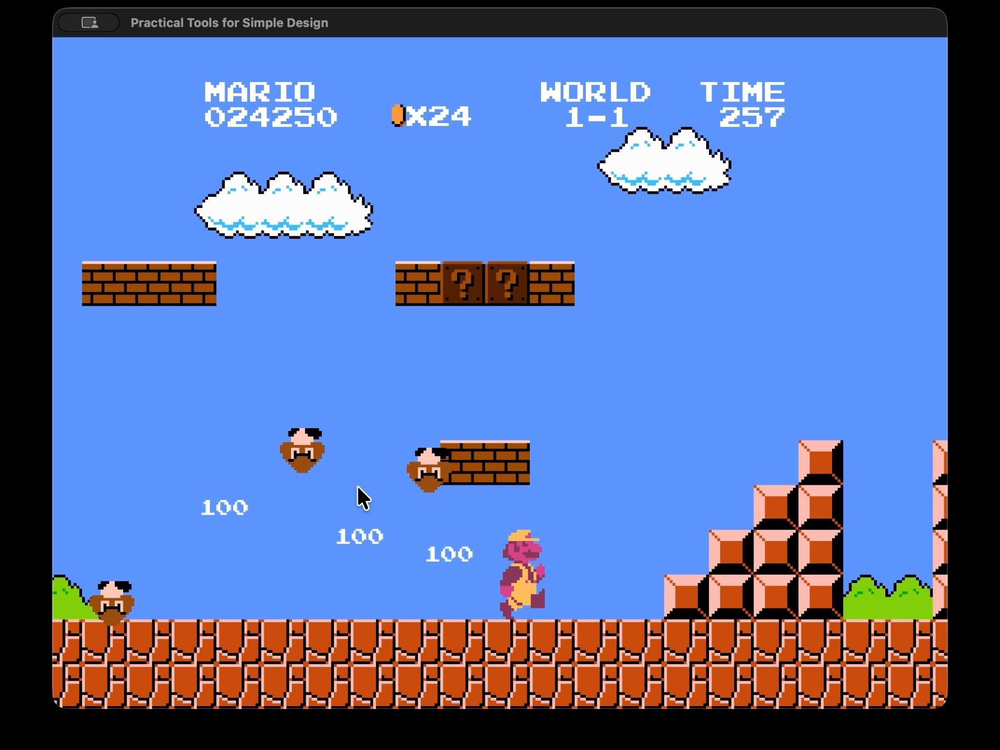 | 無敵期間輪替角色配色、播放專用音樂，碰到敵人時直接擊倒並計算連殺分數。 |
| 終點旗桿 | 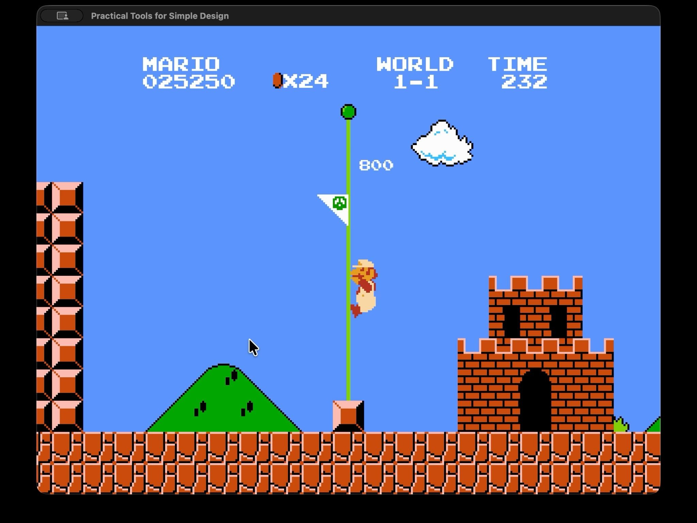 | 依碰觸旗桿的高度給分，接著播放降旗、滑下旗桿、進城及時間結算流程。 |

## 程式設計

### 開發環境

- 語言與標準：C++17。
- 建置工具：CMake，使用 Debug build 載入 `RESOURCE_DIR`。
- 遊戲框架：PTSD framework。
- 關卡資料：JSON，使用 `nlohmann::json` 解析。
- 圖形與裁切：PTSD renderer；水管及道具遮蔽使用 OpenGL scissor test。

### 程式架構

專案採用「framework 生命週期層、遊戲流程層、資料層、遊戲物件層與呈現服務層」的分工。`GameManager` 是整體協調者，但角色、敵人、方塊、道具、關卡解析、相機與音效都各自封裝在獨立類別中。

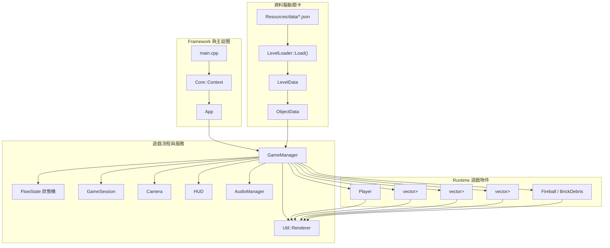

主要類別的繼承架構如下。空心箭頭可理解為「子類別繼承父類別」；`Character`、`Enemy`、`Block` 與 `Item` 提供共用資料或虛擬介面，實際行為由子類別覆寫。

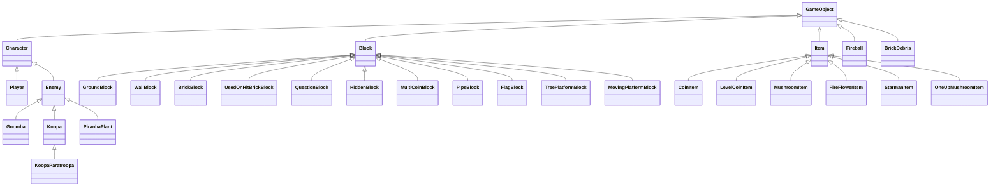

各模組的具體責任如下：

- `Core::Context`：PTSD framework 的執行環境，負責視窗、輸入事件與主迴圈更新。
- `App`：生命週期轉接器，將 `Start()`、`Update()`、`End()` 轉交給 `GameManager`，本身不包含遊戲規則。
- `GameManager`：核心協調者，管理場景物件的生命週期、更新順序、碰撞 pass、關卡切換、敵人生成、HUD、音效及 renderer。
- `GameSession`：保存 1P/2P 各自的 lives、score、coins、level、form 與 checkpoint，並負責輪替仍有生命的玩家。
- `LevelLoader` / `LevelData` / `ObjectData`：將 JSON 解析成不含遊戲邏輯的資料物件，再交由 `GameManager` 建立實際的方塊、敵人與道具。
- `Character`：可渲染角色的抽象基底類別，封裝位置、速度、尺寸、存活狀態與重力；`Player` 和 `Enemy` 分別實作輸入及 AI。
- `Enemy`：敵人的抽象基底類別，提供走路、重力、轉向、地形碰撞介面及純虛擬 `Stomp()`。
- `Block`：場景物件的抽象基底類別，定義 `GetType()`、`IsSolid()`、`IsOneWay()` 與 `OnHit()` 等介面。
- `Item`：道具的抽象基底類別，統一 `Spawning`、`Active`、`Collected` 生命週期及 `OnCollect()` 介面。
- `Camera`：追蹤玩家並將 world coordinates 轉換為 PTSD screen coordinates，同時限制鏡頭範圍。
- `HUD`：使用固定螢幕座標顯示玩家名稱、分數、金幣、世界編號與剩餘時間。
- `AudioManager`：統一管理區域 BGM、事件 BGM、SFX、音量、暫停恢復及 hurry-up 音樂。
- `Util::Renderer`：持有並依 z-index 繪製 `Util::GameObject`；runtime 新增的道具、火球與碎磚會立即註冊到 renderer。

### 程式技術

#### 1. 使用狀態機控制遊戲流程

`GameManager::FlowState` 將整體流程分成 `Title`、`LevelIntro`、`IntroCutscene`、`Playing`、`TimeUp`、`LevelClearTransition`、`LevelClearPause` 與 `GameOver`。`GameManager::Update()` 每幀只執行目前狀態對應的更新函式，使標題輸入、關卡介紹、自動進水管、正常遊玩、死亡、時間結算及切關不會混在同一段大型條件判斷中。

`Player` 內部也有另一層狀態機，包含 `Normal`、`Dying`、`LevelClear`、`IntroAutoWalk`、`EnteringPipe`、`ExitingPipe` 與 `Transforming`。因此全域遊戲流程與玩家動畫流程可以分開管理。

#### 2. 以繼承、多型與組合落實 OOP

- **抽象與繼承**：`Character` 集中角色共有的位置、速度、尺寸與重力；`Enemy` 再加入自動移動與踩踏介面。`Block` 和 `Item` 則分別定義方塊與道具的共同契約。
- **多型容器**：`GameManager` 以 `std::vector<std::shared_ptr<Enemy>>`、`std::vector<std::shared_ptr<Block>>` 和 `std::vector<std::shared_ptr<Item>>` 保存不同子類別。更新時只需要透過基底指標呼叫虛擬函式，不需要為每一種物件建立一套獨立容器。
- **覆寫行為**：同一個 `Enemy::Stomp()` 呼叫會產生不同結果：Goomba 進入壓扁死亡狀態、Koopa 縮殼或停止滑行、Koopa Paratroopa 先失去翅膀。方塊的 `OnHit()` 與道具的 `OnCollect()` 也使用相同方式分派到各子類別。
- **組合關係**：`GameManager` 不繼承遊戲物件，而是持有 `GameSession`、`Camera`、`HUD`、`AudioManager` 及各種物件容器。這些類別各自負責單一工作，再由管理器協調。
- **資料驅動工廠**：JSON 的 `type`、`enemyType` 和 `itemType` 由 `GameManager::LoadLevel()`、`SpawnEnemy()` 與 `SpawnItem()` 映射成對應子類別。新增物件時主要擴充類別與集中式 mapping，不必把所有行為寫進單一巨大類別。

程式只在需要「子類別特有功能」時使用安全的 RTTI 向下轉型 `dynamic_cast`。例如：

- 將 `Block*` 轉為 `PipeBlock*`，讀取目的關卡與水管開口。
- 將 `Block*` 轉為 `FlagBlock*`，依玩家碰觸高度計算旗桿分數。
- 將 `Enemy*` 轉為 `Koopa*`，判斷龜殼狀態、踢殼及連殺計數。
- 將 `Block*` 轉為 `MovingPlatformBlock*`，取得該幀位移量並帶著玩家移動。

`dynamic_cast` 失敗時會回傳 `nullptr`，程式會先檢查再使用。一般更新、繪製、踩踏、方塊撞擊與道具收集仍透過虛擬函式完成，避免把所有子類別行為都依賴型別判斷。

#### 3. JSON 關卡載入與資料驅動設計

關卡載入分為兩個階段：

1. `src/LevelLoader.cpp` 的 `LevelLoader::Load()` 讀取 `Resources/data/*.json`，解析 `backgroundImage`、`levelWidth`、`levelHeight`、`playerSpawn`、`objects`、`introCutscene` 與 `checkpoints`，並回傳定義於 `include/LevelData.hpp` 的 `LevelData`。
2. `src/GameManager.cpp` 的 `GameManager::LoadLevel()` 走訪 `LevelData::objects`，依 `ObjectData::type` 建立 `GroundBlock`、`QuestionBlock`、`PipeBlock`、`FlagBlock`、`MovingPlatformBlock` 等 runtime 物件；`EnemySpawn` 則先存入生成佇列。

這種設計將「關卡內容」與「C++ 行為」分開。調整物件位置、平台長度、水管目標或 checkpoint 時只需修改 JSON，不必重新改寫遊戲流程；同時 `ObjectData` 作為解析層與 runtime 層之間的資料傳輸物件，可避免 JSON 格式直接滲入各遊戲物件。

#### 4. 橫向捲軸鏡頭與座標轉換

遊戲邏輯採左上角為原點、x 向右、y 向下的 world coordinates；PTSD 則以視窗中心為原點、y 向上。`Camera::WorldToScreen()` 統一完成兩套座標的轉換：

```text
screenX = (worldX - cameraX) × GAME_SCALE - windowWidth / 2
screenY = windowHeight / 2 - worldY × GAME_SCALE
```

每個 tile 為 16×16 world pixels，`GAME_SCALE = 3`，因此 NES 高度 240 pixels 可放大至 720 pixels。`Camera::Update()` 先嘗試讓玩家位於畫面中央，再將鏡頭夾在 `[0, levelWidth - viewWidth]`。最後使用 `m_X = max(m_X, desiredX)` 實作只向右、不向左回捲的棘輪式鏡頭，並由 `Player::ClampToCameraBounds()` 防止玩家走回鏡頭左側。

#### 5. 碰撞與物理處理

玩家、敵人、道具、火球與地形主要使用 AABB（Axis-Aligned Bounding Box）判斷是否重疊。為了正確判斷碰撞方向，玩家與方塊碰撞不只看目前位置，而會同時參考 previous position、velocity、水平重疊量與 penetration：

- **Pass 1：撞頭**——玩家向上移動且從方塊底面穿越時，從候選方塊中選出水平重疊最大的目標，只呼叫一次 `Block::OnHit()`，避免一次撞到相鄰多格方塊。
- **Pass 2A：落地**——比較上一幀腳底與本幀腳底是否跨過方塊頂面，將玩家貼齊最先接觸的表面並清除向下速度。單向平台只參與此步驟。
- **Pass 2B：側撞**——對剩餘重疊計算 x/y penetration，只在水平穿透較小時修正 x 位置，並清除朝牆方向的速度。
- **移動平台補償**——支撐容差加入平台該幀的垂直位移；玩家站在平台上時同步平台的水平位移，避免平台移動後將玩家留在原地。

另外，`GameManager::Update()` 會把單幀 `delta time` 限制在 `1/30` 秒，角色也有最大落下速度，降低視窗卡頓或載入後單幀位移過大造成穿透的風險。敵人、道具、火球與方塊則各有獨立 collision pass，讓不同互動規則可以分開維護。

#### 6. 水管切換與裁切動畫

可進入水管會在 JSON 設定 `opening`、`targetLevel`、`targetSpawn` 等欄位。`PipeBlock::CanEnter()` 會依水管方向、玩家位置與按鍵判斷是否可進入；成功後 `GameManager` 暫存目標關卡及出生點，並呼叫 `Player::StartPipeEntry()`。

進出水管時，`Player` 不會瞬間傳送，而是以 `glm::mix()` 在起點與終點間進行線性插值。由於水管本身是背景圖的一部分，無法自然遮住玩家，專案另外實作 `ClipDrawable`：它包裝原本的角色 drawable，依水管開口方向設定上、下、左或右裁切線，再透過 OpenGL `glScissor()` 只繪製管口外側的部分，使角色看起來逐漸沒入或鑽出水管。道具從方塊冒出及 Piranha Plant 升出水管時也重用相同的裁切機制。

動畫結束後，`GameManager::ChangeLevel()` 清理舊場景、載入目標 JSON、套用 `targetSpawn`、重建 renderer 與 HUD；若出生點位於水管口，接著播放鑽出動畫。

#### 7. 延遲生成與效能控制

載入關卡時，`EnemySpawn` 不會立即建立敵人物件，而是先保存於 `m_EnemySpawnQueue`。每幀由 `CheckEnemySpawnQueue()` 計算鏡頭右邊界加上 32 pixels 的預載距離，只有進入此範圍的資料才交給 `SpawnEnemy()` 建立實體並加入 renderer。

此設計可避免遠處敵人在畫面外提前走動或掉落，也減少同一時間需要更新與碰撞檢查的物件數量。程式另外重用移除方塊、道具與火球的暫存容器，降低 per-frame 動態配置。

#### 8. 物件生命週期與渲染管理

敵人、方塊、道具、火球與碎磚主要以 `std::shared_ptr` 管理，並同時註冊至 `Util::Renderer`。物件失效後先設為不可見，再從對應容器移除；renderer 重建時則由 `BuildScene()` 重新加入仍存在的物件。`Player` 是 `GameManager` 的成員物件，不由 renderer 擁有，因此加入 renderer 時使用 no-op deleter，避免錯誤釋放 stack member。

#### 9. 音效系統

`AudioManager` 封裝 overworld、underground、starman、death、level clear、game over 與 hurry-up 等音樂流程，並區分區域 BGM、事件 BGM 與短音效。暫停時統一暫停音樂，恢復時回到正確曲目；星星效果結束或水管切換後，也會根據目前狀態恢復對應 BGM。SFX 使用 cache，避免每次播放都重新建立音效物件；資源不存在時只記錄 warning，不讓遊戲直接中止。

### 使用到 AI／AI Agent 的部分

本專案使用 Codex 與 Claude 輔助開發，主要用途包含：協助追蹤跨檔案程式流程、產生或重構部分程式碼、分析編譯與 runtime 錯誤、提出碰撞及狀態機的除錯方向，以及整理文件。AI 產生的內容仍由我依照實際架構進行修改、整合與測試，最終設計與程式正確性由我自行確認。

## 結語

### 問題與解決方法

- **碰撞：高速落下或畫面卡頓後可能穿過地形**
  - 若只檢查本幀 AABB 是否重疊，角色可能在單幀內直接跨過較薄的地形，或因穿透量相近而誤判方向。
  - 解法是保存 previous position，以下落方向與「上一幀腳底在平台上方、本幀腳底跨過平台頂面」作為落地條件；同時限制最大 frame delta 與終端速度，讓單幀位移維持在可處理範圍。
- **碰撞：頂磚、落地與側撞互相干擾**
  - 原本若在同一個迴圈中一邊掃描方塊、一邊修改玩家位置，後續方塊會使用已修正的位置判斷，可能造成一次撞到相鄰方塊或將側撞誤判為落地。
  - 後來將碰撞拆成撞頭、落地、側撞三個階段；撞頭只選水平重疊最大的方塊，落地依跨越頂面判斷，最後才處理剩餘水平穿透，使各方向的規則互不干擾。
- **地圖載入：遠處敵人會在畫面外提前行動**
  - Mario 關卡很長，如果載入時直接建立全部敵人，遠處敵人可能在玩家抵達前移動、互撞或掉出場景，也會增加不必要的更新與碰撞成本。
  - 因此先將 `EnemySpawn` 保存於 queue，等其 x 座標進入鏡頭右側預載範圍後才建立實體。這同時改善遊戲行為與執行效率。
- **畫面：角色進入水管時仍顯示在水管表面**
  - 水管圖像屬於關卡背景，單純調整 z-index 無法讓背景的一部分遮住角色。
  - 因此實作可包裝任意 drawable 的 `ClipDrawable`，依管口方向計算 framebuffer 裁切線，使用 `glScissor()` 只保留管口外側的角色圖像，完成進出水管的遮蔽效果。
- **OOP：敵人、方塊與道具種類增加後難以維護**
  - 若把每種物件的狀態與行為全部寫在 `GameManager` 的大型 if-else 中，新增功能時容易影響既有物件，也會產生重複程式碼。
  - 解法是建立 `Character`、`Enemy`、`Block`、`Item` 等抽象層，透過繼承與虛擬函式統一更新介面，再由 Goomba、Koopa、QuestionBlock、MushroomItem 等子類別覆寫差異行為。`GameManager` 只負責協調物件互動與生命週期，JSON type mapping 則集中負責建立正確子類別。
- **座標：遊戲世界與 PTSD 畫面座標定義不同**
  - 關卡資料使用左上角為原點且 y 向下，PTSD 使用視窗中心為原點且 y 向上；若每個物件自行換算，容易出現縮放或偏移不一致。
  - 因此將轉換集中於 `Camera::WorldToScreen()`，所有場景物件只保存 world coordinates，繪製時再統一扣除鏡頭 x、反轉 y 並乘上 `GAME_SCALE`。

### 自評

| 項次 | 項目 | 完成 |
|:---:|---|:---:|
| 1 | 完成專案權限改為 public | V |
| 2 | 具有 Debug mode 功能 | V |
| 3 | 解決專案中所有已發現的 Memory Leak | V |
| 4 | 報告內容完整，並完成錯字與遺漏檢查 | V |
| 5 | 報告具備基本排版與可讀性 | V |

### 心得

- **113370239 徐法恩**

OOPL 是我這學期花最多時間的一門課。身為一名轉系生，我接觸程式設計的時間比班上同學少了一年，加上上學期 OOP 中「多型」的部分學得並不扎實，因此在修這門課之前，我其實感到相當擔憂。當我看到學長姐的成品介紹影片時，心中不免懷疑自己：我真的有能力獨自復刻一款遊戲嗎？就這樣，我抱著期待又忐忑的心情，踏入了這門課。

這門課帶給我的第一個難關，並不是程式本身，而是分組。班上我們三個人是很好的朋友，但課程規定只能兩人一組，這讓我一開始非常為難。好不容易決定分組後，我又和組員在合作方式上產生了很大的分歧。當時我下定決心要拆組，這件事情對我的打擊很大，也讓我低落了好幾週。

後來自己一組後，我才真正感受到獨自完成專案的壓力。最困難的地方在於，遇到任何問題都必須靠自己面對與解決。平常的我其實比較內向，不太敢主動提問，因此光是熟悉整個框架，就花了將近六週的時間。那段時間壓力很大，但我心裡一直告訴自己，不能這麼輕易放棄。身處 AI 時代，我很幸運能使用許多工具輔助學習，而真正的關鍵，其實是自己有沒有決心把問題解決。

在過程中，我也逐漸發現自己有很強烈的比較心態。當我聽到同學說他們靠 AI 很快就完成專案，之後還有時間做自己的事情時，我心裡也變得急躁，只想趕快用 AI 把作業完成、交出去就好。然而，越是抱著這種交差了事的心態，專案反而越做不出來。後來我才意識到，問題不只是技術能力不足，而是我並沒有真正想把這個作品做好。

當我放下這種急著比較、急著完成的心態，開始認真面對每一個問題、一步一步解決遇到的困難時，我才發現自己其實做得到。這門課不只是讓我學會如何完成一個遊戲專案，更讓我學會如何在壓力、挫折與自我懷疑中繼續前進。對我來說，OOPL 帶來的不只是程式能力上的成長，也讓我在面對困難時，更相信自己有能力撐過去並完成目標。

### 貢獻比例

| 組員 | 主要貢獻 | 貢獻比例 |
|:---:|---|:---:|
| 113370239 徐法恩 | 獨立完成遊戲設計、程式實作、關卡與資產整合、測試除錯及報告 | 100% |
