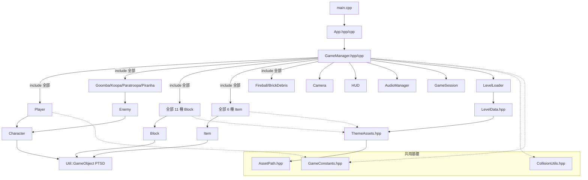
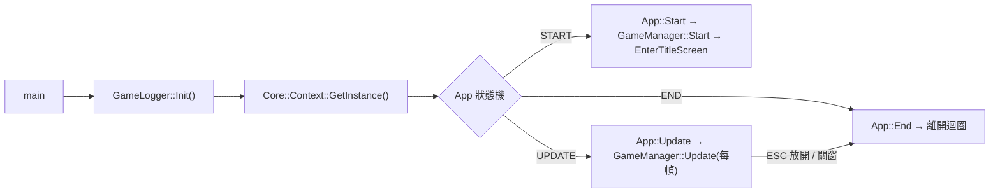
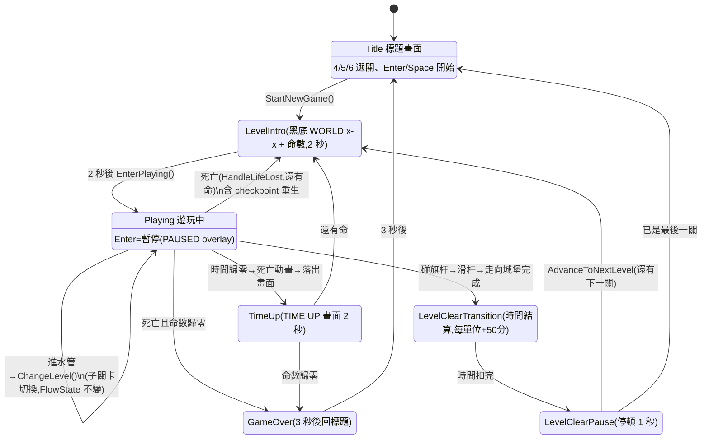
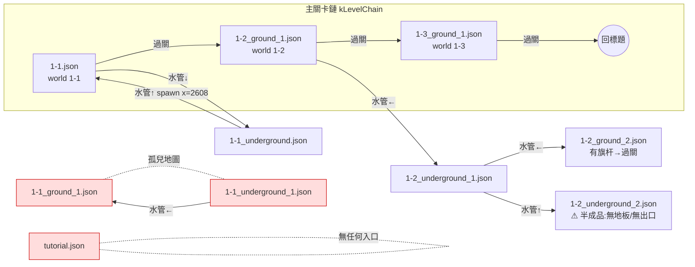

# OOPL Mario 架構分析報告

> 產生日期:2026-06-12
> 範圍:`src/`、`include/` 全部 runtime 程式碼(約 6,800 行)+ `Resources/data/*.json`
> 圖表使用 Mermaid 語法,GitHub / VSCode(裝 Mermaid 外掛)可直接渲染。

---

## 一、專案概觀

- C++17 / CMake,基於 **PTSD framework v0.2**(提供 `Util::GameObject`、`Util::Renderer`、`Util::Image/Animation/Text`、`Util::BGM/SFX`、`Util::Input`、`Core::Context`)。
- 入口:`main.cpp` → `App`(狀態機殼)→ `GameManager`(所有遊戲邏輯的中樞,1,999 行)。
- 關卡資料:`Resources/data/*.json`,由 `LevelLoader` 解析成 `LevelData`/`ObjectData` 純資料結構。
- 只能以 `-DCMAKE_BUILD_TYPE=Debug` 建置(Release 在 CMakeLists.txt 直接 `FATAL_ERROR`,RESOURCE_DIR 相對路徑仍是 WIP)。

---

## 二、完整 OOP 類別圖

### 2.1 繼承體系(is-a)

```mermaid
classDiagram
    direction TB

    class GameObject["Util::GameObject (PTSD)"] {
        +m_Transform
        +SetDrawable()
        +SetVisible()
        +SetZIndex()
        +AddChild()
    }

    %% ── 角色體系 ──
    class Character {
        <<abstract>>
        #vec2 m_Position
        #vec2 m_Velocity
        #vec2 m_Size
        #bool m_IsAlive
        #float m_Gravity
        +Update(dt)*
        +Draw(camera)*
        +ApplyGravity(dt)
    }
    class Player {
        +enum Form SMALL/SUPER/FIRE
        +enum State Normal/Dying/LevelClear/EnteringPipe/ExitingPipe/Transforming
        +HandleInput() Jump() Downgrade()
        +StartTransformAnimation()
        +StartPipeEntry/Exit()
        +StartLevelClearSequence()
        -3套 VisualAssets×3形態(normal/damage/star)
    }
    class Enemy {
        <<abstract>>
        #float m_WalkSpeed
        +Stomp()*
        +ReverseDirection()
        +UsesBlockCollision()
    }
    class Goomba {
        -m_IsSquashed
        +Stomp() 壓扁→0.5s後消失
    }
    class Koopa {
        +enum Variant Green/Red
        -m_InShell m_IsSliding m_IsDying
        +Stomp() 縮殼
        +Kick() 殼滑行
        +Die() 翻轉飛出
        5s後甦醒
    }
    class KoopaParatroopa {
        +enum FlightMode Hop/VerticalPatrol
        -m_HasWings
        +Stomp() 先掉翅膀再縮殼
    }
    class PiranhaPlant {
        +enum State Hidden/Rising/Extended/Lowering
        +SetPlayerX() 玩家靠近不升出
        +Stomp() 不可踩(空實作)
        +UsesBlockCollision() false
    }

    GameObject <|-- Character
    Character <|-- Player
    Character <|-- Enemy
    Enemy <|-- Goomba
    Enemy <|-- Koopa
    Enemy <|-- PiranhaPlant
    Koopa <|-- KoopaParatroopa

    %% ── 方塊體系 ──
    class Block {
        <<abstract>>
        +enum Type Ground/Brick/Question/Pipe/Flag/Wall/...
        #m_ItemType 夾帶道具
        #m_IsUsed
        +GetType()* IsSolid()*
        +OnHit(Player*) BlockHitResult
        #SetSprite()
    }
    class GroundBlock["GroundBlock (隱形碰撞盒)"]
    class WallBlock
    class BrickBlock["BrickBlock (大個子可打碎/可藏道具)"]
    class QuestionBlock["QuestionBlock (敲一次出道具+彈跳)"]
    class HiddenBlock["HiddenBlock (敲到才現形, IsSolid=m_IsUsed)"]
    class MultiCoinBlock["MultiCoinBlock (連續出金幣N次)"]
    class UsedOnHitBrickBlock["UsedOnHitBrickBlock (敲一次變空磚)"]
    class FlagBlock["FlagBlock (終點旗杆, 依高度計分)"]
    class MovingPlatformBlock["MovingPlatformBlock (oscillate/verticalWrap)"]
    class TreePlatformBlock["TreePlatformBlock (多段樹頂平台)"]
    class PipeBlock {
        +GetOpening()
        +IsEnterable() false
        +CanEnter() false
    }
    class EnterablePipeBlock {
        -m_TargetLevel m_ExitToLevel m_TargetSpawn
        +CanEnter() 依開口方向+按鍵判斷
    }
    class PipeCollisionBlock["PipeCollisionBlock (隱形,只擋路)"]

    GameObject <|-- Block
    Block <|-- GroundBlock
    Block <|-- WallBlock
    Block <|-- BrickBlock
    Block <|-- QuestionBlock
    Block <|-- HiddenBlock
    Block <|-- MultiCoinBlock
    Block <|-- UsedOnHitBrickBlock
    Block <|-- FlagBlock
    Block <|-- MovingPlatformBlock
    Block <|-- TreePlatformBlock
    Block <|-- PipeBlock
    PipeBlock <|-- EnterablePipeBlock
    PipeBlock <|-- PipeCollisionBlock

    %% ── 道具體系 ──
    class Item {
        <<abstract>>
        +enum ItemState Spawning/Active/Collected
        +Update(dt)* OnCollect(Player*)* GetType()*
        #ApplyGravity()
    }
    class MushroomItem["MushroomItem (升SUPER,會走動)"]
    class FireFlowerItem["FireFlowerItem (升FIRE,不動)"]
    class StarmanItem["StarmanItem (無敵10s,彈跳前進)"]
    class OneUpMushroomItem["OneUpMushroomItem (+1命)"]
    class CoinItem["CoinItem (磚塊噴出,自動收集)"]
    class LevelCoinItem["LevelCoinItem (場上靜止金幣,觸碰收集)"]

    GameObject <|-- Item
    Item <|-- MushroomItem
    Item <|-- FireFlowerItem
    Item <|-- StarmanItem
    Item <|-- OneUpMushroomItem
    Item <|-- CoinItem
    Item <|-- LevelCoinItem

    %% ── 其他 GameObject ──
    class Fireball["Fireball (彈跳前進,撞牆/敵人爆炸)"]
    class BrickDebris["BrickDebris (磚塊碎片,4片拋物線)"]
    GameObject <|-- Fireball
    GameObject <|-- BrickDebris
```



### 2.2 組合關係(has-a)

```mermaid
classDiagram
    direction LR
    class App {
        +enum State START/UPDATE/END
        +Start() Update() End()
    }
    class GameManager {
        +enum FlowState Title/LevelIntro/Playing/TimeUp/LevelClearTransition/LevelClearPause/GameOver
        -kLevelChain 關卡鏈
        +Start() Update()
        -LoadLevel() ChangeLevel()
        -Check*Collision() ×8
        -Spawn*() ×4
    }
    class GameSession {
        2 個 PlayerProgress 槽位(Mario/Luigi)
        +AddScore/AddCoin/AddLife/LoseLife
        +SwitchToNextAlivePlayer()
    }
    class Camera {
        -float m_X 棘輪只進不退
        +WorldToScreen()
        +Update(targetX, levelWidth)
    }
    class HUD {
        分數/金幣/世界/時間 文字物件
        +Init(renderer) Update(score,coins,time)
    }
    class AudioManager {
        BGM 單例播放 + SFX 快取
        缺檔優雅降級(warn+靜音)
    }
    class LevelLoader {
        <<static>>
        +Load(jsonPath) LevelData
    }
    class LevelData {
        <<struct>>
        背景圖/尺寸/theme/playerSpawn
        vector~ObjectData~ objects
        vector~vec2~ checkpoints
    }
    class ThemeAssets {
        Ground/Underground
        +Sprite("path/{theme}/..")
    }

    App *-- GameManager : 持有
    GameManager *-- "1" Player
    GameManager *-- "n" Enemy : shared_ptr
    GameManager *-- "n" Block : shared_ptr
    GameManager *-- "n" Item : shared_ptr
    GameManager *-- "n" Fireball
    GameManager *-- "n" BrickDebris
    GameManager *-- Camera
    GameManager *-- GameSession
    GameManager *-- HUD
    GameManager *-- AudioManager
    GameManager *-- LevelData
    GameManager *-- ThemeAssets
    GameManager *-- "Util::Renderer" : 渲染清單
    GameManager ..> LevelLoader : 使用
    LevelLoader ..> LevelData : 產生
    Block ..> ThemeAssets : 取得主題素材
```

**輔助工具(無繼承、無狀態或純函式)**
| 元件 | 形式 | 用途 |
|---|---|---|
| `CollisionUtils::CheckAABB` | header-only inline | 矩形重疊判斷,所有碰撞的基礎 |
| `MakeAssetPath()` | header-only inline | `RESOURCE_DIR/Asset/` 路徑組裝 |
| `GameConstants.hpp` | 全域 constexpr | TILE_SIZE=16、GAME_SCALE=3、所有物理常數 |
| `GameLogger` | static class | spdlog 雙 sink(console+檔案 `logs/mario_*.log`) |
| `Util/ImagePath.hpp` | 全域 inline string | 玩家三形態的素材路徑常數 |

---

## 三、cpp 與 hpp 的關係

### 3.1 配對狀況

**一對一配對(`include/X.hpp` ↔ `src/X.cpp`),共 36 對:**
App、AudioManager、Block、BrickBlock、BrickDebris、Camera、Character、CoinItem、Enemy、FireFlowerItem、Fireball、FlagBlock、GameLogger、GameManager、GameSession、Goomba、GroundBlock、HUD、HiddenBlock、Item、Koopa、KoopaParatroopa、LevelCoinItem、LevelLoader、MovingPlatformBlock、MultiCoinBlock、MushroomItem、OneUpMushroomItem、PipeBlock、PiranhaPlant、Player、QuestionBlock、StarmanItem、TreePlatformBlock、UsedOnHitBrickBlock、WallBlock

**Header-only(只有 .hpp,實作全在標頭):**
AssetPath、CollisionUtils、GameConstants、LevelData、ThemeAssets、Util/ImagePath

**只有 .cpp:** `main.cpp`(程式進入點)

**一個 .hpp 多個類別:**
- `PipeBlock.hpp` → `PipeBlock` + `EnterablePipeBlock` + `PipeCollisionBlock`
- `GameSession.hpp` → `GameSession` + `PlayerProgress`(struct)+ `PlayerSlot`(enum)
- `LevelData.hpp` → `LevelData` + `ObjectData`(皆為純資料 struct)

### 3.2 include 依賴(主幹)



> 註:`GameManager.hpp` include 了專案幾乎所有標頭(god header),任何標頭改動都會觸發 GameManager 重編譯;`Block.hpp` 被重複 include 兩次(第 9、29 行,無害但冗餘)。

---

## 四、遊戲流程圖

### 4.1 程式生命週期



### 4.2 FlowState 狀態機(GameManager)



### 4.3 UpdatePlaying 每幀流程(核心迴圈)

```mermaid
flowchart TD
    S([每幀 dt = min raw, 1/30]) --> P{Enter 按下?}
    P -->|是| TG[切換暫停/PAUSED overlay]
    TG --> PA{暫停中?}
    P -->|否| PA
    PA -->|是| RO[只 Renderer.Update 後 return]
    PA -->|否| PIPE{進水管動畫播完?}
    PIPE -->|是| CL["ChangeLevel(pendingLevel) → return"]
    PIPE -->|否| PU["Player.Update(dt)"]
    PU --> AE[音效事件:跳躍 SFX / 星星結束恢復 BGM / 死亡 BGM]
    AE --> FR{水管動畫中 or 變身中?}
    FR -->|是| CAMF[只更新鏡頭+DrawScene → return]
    FR -->|否| DY{玩家死亡中?}
    DY -->|否| W[更新世界:敵人(食人花同步玩家X)/方塊/道具/火球/碎片/得分彈出]
    W --> SH{要求射火球? 場上<2顆}
    SH --> CAM[Camera.Update 棘輪] --> SQ[CheckEnemySpawnQueue 鏡頭觸發生成]
    SQ --> BC[CheckBlockCollision\nPass1 頂磚→Pass2A 落地→Pass2B 側碰]
    BC --> PT{CheckPipeTransition?}
    PT -->|否| CC[敵人方塊碰撞→道具方塊→吃道具→踩踏→殼撞敵→火球→旗杆]
    PT -->|是| CAM2[鏡頭再更新]
    CC --> CLAMP[玩家左界夾制] --> CP[UpdateCheckpoints]
    DY -->|是| KZ
    CP --> KZ{Kill Z 判定 y > levelHeight+50}
    KZ -->|玩家落下| LL[HandleLifeLost → LevelIntro/GameOver]
    KZ -->|否| FLAGQ{已碰旗 & 過關動畫完?}
    FLAGQ -->|是| LCT2[EnterLevelClearTransition]
    FLAGQ -->|否| TIME[倒數 m_TimeRemaining -= dt×2.5]
    TIME -->|歸零| TU[強制 SMALL→Downgrade 死亡動畫\n→落出畫面後 EnterTimeUp]
    TIME --> DS[DrawScene:全部 Draw + 背景 + HUD + Renderer.Update]
```

### 4.4 關卡鏈與水管傳送圖



> 註:`1-2_ground_2` 過關走的是旗杆(其旗杆過關後 `AdvanceToNextLevel` 依 `m_CurrentLevelIndex` 推進,因此 1-2 系列子關卡共用「1-2」這格進度)。

### 4.5 碰撞與計分規則摘要

| 互動 | 處理函式 | 結果 |
|---|---|---|
| 玩家從下方頂磚 | `CheckBlockCollision` Pass 1(取水平重疊最大者) | `OnHit()`:出道具/碎磚 50 分/bump;頂磚順帶殺正上方敵人、踢飛道具 |
| 玩家踩敵人 | `CheckStompCollision` | combo 計分 100→200→…→5000→1UP;踩龜=縮殼;踩殼=踢殼 400 分 |
| 側碰敵人 | 同上 | 玩家 Downgrade(FIRE→SUPER→SMALL→死),變身動畫後 2 秒無敵 |
| 滑行殼撞敵 | `CheckShellEnemyCollision` | 獨立殼 combo 計分 |
| 火球擊中 | `CheckFireballCollision` | Goomba 100 / Koopa 200(翻轉飛出) |
| 星星無敵碰敵 | `CheckStompCollision` 前段 | combo 計分,Koopa 翻轉死 |
| 碰旗杆 | `CheckFlagCollision` | 依接觸高度 100~5000 分,觸發過關演出 |
| 金幣 | `SpawnItem("Coin")` / `LevelCoinItem` | +1 金幣 +200 分;滿 100 金幣自動 +1 命 |
